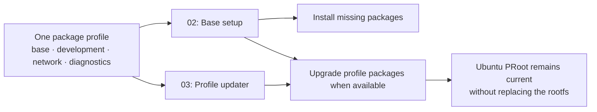

# termux-ubuntu-bootstrap

Bootstrap a minimal, reproducible Ubuntu PRoot environment from Termux, then
layer a maintained profile of command-line, network, and development utilities
on top. The project is deliberately split into small scripts so provisioning,
daily package maintenance, and destructive recovery never become the same
operation.

## Why this exists

Installing Ubuntu through `proot-distro` is easy; keeping that environment
predictable over time is the harder part. This project turns that process into
an explicit automation contract:

- create or reuse an Ubuntu PRoot environment from Termux;
- reconcile one declared package profile instead of accumulating ad-hoc tools;
- update only the packages managed by that profile; and
- require an explicit `--fresh` decision before replacing an existing rootfs.

It targets a terminal-only environment. Graphical desktops, unrelated runtime
managers, and AI CLIs are intentionally outside its baseline.

## Status

This repository is being built from three previously functional local scripts.
The initial commit establishes the public repository contract and branch model;
the scripts will be refactored in subsequent commits without publishing the
original local references.

## Planned architecture

| Layer | Responsibility | Safety contract |
| --- | --- | --- |
| `01-bootstrap-termux-ubuntu.sh` | Install `proot-distro` and provision Ubuntu | Never replaces an existing Ubuntu unless invoked with `--fresh`. |
| `02-setup-ubuntu-base.sh` | Reconcile a declared profile of base, development, and network utilities | Installs only missing packages and upgrades the declared profile. |
| `03-update-ubuntu-profile.sh` | Refresh the packages already managed by the profile | Does not reinstall Ubuntu or add unrelated runtimes. |

The package profile will be shared by layers 2 and 3 so that they cannot drift.
The updater will manage distribution packages only; deprecated AI CLI setup from
the legacy maintenance script is intentionally out of scope.

## Automation flow

```mermaid
flowchart TD
    A[Run bootstrap from Termux] --> B[Update Termux packages]
    B --> C[Ensure proot-distro is installed]
    C --> D{Ubuntu rootfs exists?}
    D -- No --> E[Install Ubuntu]
    D -- Yes, without --fresh --> F[Preserve the existing rootfs]
    D -- Yes, with --fresh --> G[Confirm and replace Ubuntu]
    G --> E
    E --> H[Login to Ubuntu PRoot]
    H --> I[Run base setup as root]
    F --> I
    I --> J[Reconcile the declared package profile]
    J --> K[Ready for terminal development]
```

`--fresh` is a recovery/provisioning mode, not an upgrade path. Normal runs
preserve the installed Ubuntu environment and only reconcile its declared
profile.

## Package-profile lifecycle



The shared profile is the single source of truth. The setup script converges a
new or existing Ubuntu installation to it; the updater later refreshes only
those same packages. A future full-system upgrade, if added, will be a distinct
opt-in command.

## Operational boundaries

| Operation | Where it runs | What it may change | What it must not do |
| --- | --- | --- | --- |
| Bootstrap | Termux | Termux dependencies and an Ubuntu PRoot rootfs | Remove Ubuntu without `--fresh` |
| Base setup | Ubuntu PRoot as root | Packages in the declared profile | Install undeclared runtimes or CLIs |
| Profile updater | Ubuntu PRoot as root | Available upgrades for profile packages | Reinstall Ubuntu or perform an implicit full-system upgrade |

## Planned package groups

The profile will classify packages rather than maintain one opaque list:

- **Base:** certificates, shell ergonomics, editors, archive tools and process
  inspection.
- **Development:** compiler toolchain, Python, build helpers, Git and JSON
  tooling.
- **Network:** HTTP clients, DNS lookup, reachability, socket and route
  diagnostics.
- **Operations:** terminal multiplexing, disk/process visibility and safe
  transfer utilities.

Each group will be declared once and tested for idempotent installation and
profile-only upgrades.

## Utility ownership and updates

The following profiles are now declared in `config/package-profile.sh`:

| Profile | Examples | Installed by | Updated by |
| --- | --- | --- | --- |
| Base | `curl`, `wget`, `nano`, archives, certificates | `02-setup-ubuntu-base.sh` | `03-update-ubuntu-profile.sh` if already installed |
| Development | compiler toolchain, CMake, Ninja, Python, Git, GDB | `02-setup-ubuntu-base.sh` | `03-update-ubuntu-profile.sh` if already installed |
| Network | `iproute2`, DNS tools, `netcat-openbsd`, `socat`, `mtr-tiny`, SSH and rsync | `02-setup-ubuntu-base.sh` | `03-update-ubuntu-profile.sh` if already installed |
| Analysis | `nmap`, `lsof`, `strace`, `sysstat`, `htop`, `ncdu` | `02-setup-ubuntu-base.sh` | `03-update-ubuntu-profile.sh` if already installed |
| AI workflow | `ripgrep`, `fd-find`, `fzf`, `jq`, `tmux`, `shellcheck`, `shfmt` | `02-setup-ubuntu-base.sh` | `03-update-ubuntu-profile.sh` if already installed |

`nmap` and `netcat-openbsd` are included for authorized diagnostics of systems
you own or are permitted to test. The project never runs scans automatically.
The AI-workflow profile deliberately provides inspection and quality tools, not
an opinionated AI provider or a deprecated CLI.

The setup script uses normal `apt-get install`, so it installs missing profile
packages and obtains the newest version offered by the configured Ubuntu
repositories. The updater instead uses `apt-get install --only-upgrade` over
the already-installed packages in the same manifest. Therefore it does not add
new utilities, recreate Ubuntu, or silently perform a whole-system upgrade.

## Stable development suite

In addition to the Ubuntu package profile, setup and update manage three
upstream stable runtimes:

| Runtime | Setup | Update path |
| --- | --- | --- |
| Python | Astral `uv` plus its latest stable managed Python | `uv self update` and `uv python upgrade` |
| Node.js | NodeSource Node LTS repository and `nodejs` package | Refresh Node LTS repository then APT update |
| Go | Latest stable Linux archive selected from Go's official JSON feed | Downloaded archive with official SHA-256 verification; previous versions remain available under `/opt` |

Rust is deliberately excluded because the target is Termux/Ubuntu PRoot and it
requires an environment-specific compatibility decision. PHP and Java are not
part of this suite. The updater makes no attempt to install an AI provider or
CLI; it provides neutral tooling for any agent instead.

The runtime installers use HTTPS and official distribution endpoints. Go is
verified against the checksum supplied by its official release feed. NodeSource
configures a signed APT repository; uv uses its supported standalone installer.

## Operational controls

The Ubuntu setup and updater take an exclusive lock, require at least 1 GiB of
free space, and use a bounded APT lock timeout. Each run writes a log under
`/var/log/termux-ubuntu-bootstrap/`; only the five newest logs per operation
are retained. Steps continue independently where safe, and a non-zero final
status includes a concise summary of every failed or skipped step with the log
path for diagnosis.

## Safety model

- Run the bootstrap script from Termux.
- Run the base setup and updater from the Ubuntu PRoot as root.
- `--fresh` is the only mode allowed to remove an existing Ubuntu rootfs.
- Before installing Ubuntu, bootstrap requires at least 4 GiB usable storage
  while retaining a 20% free-space reserve.
- A rootfs that exists but cannot start is reported as damaged; it is never
  replaced unless `--fresh` is explicitly confirmed.
- Network checks must use HTTPS and report a useful failure.
- Package upgrades must be explicit, non-interactive, and limited to the
  declared profile unless a future full-system mode is added.

## What is not implemented yet

The public repository currently contains the project contract and documentation
only. The three scripts listed above will be introduced and tested on `dev` in
that order. The local reference scripts are preserved for comparison, but are
not part of the published source tree.

## Branches

- `dev`: integration branch for the initial refactor.
- `main`: stable branch; initially mapped to the verified `dev` setup commit.

## Local references

The supplied functional scripts are retained locally under `docs/reference/`.
That directory is intentionally ignored and excluded from archives, so it is
not part of the public repository or its releases.

## License

No license has been selected yet. Choose one before inviting reuse or external
contributions.
